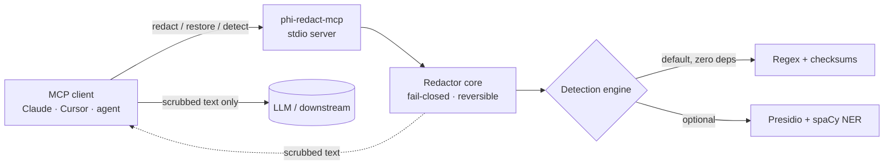

<!-- mcp-name: io.github.rinava/phi-mcp -->

# phi-redact-mcp

**An MCP server that redacts PII/PHI from text before it ever reaches an LLM — self-hosted, fail-closed, and HIPAA-aware.**

[](https://pypi.org/project/phi-redact-mcp/)
[](https://github.com/Rinava/phi-mcp/actions/workflows/ci.yml)
[](https://pypi.org/project/phi-redact-mcp/)
[](LICENSE)
[](https://github.com/astral-sh/ruff)
[](CONTRIBUTING.md)

Teams building LLM and agent pipelines in regulated domains have no clean, drop-in way to strip PHI/PII from a payload *before* it crosses into a model provider's infrastructure. `phi-redact-mcp` is that boundary: three MCP tools — `redact`, `restore`, `detect` — that scrub sensitive values into reversible placeholders, run entirely inside infrastructure you control, and **block the request if detection is uncertain instead of leaking data**.

```text
$ redact "Patient MRN: 1234567, provider NPI 1234567893, ssn 078-05-1120, john.doe@example.com"

  → "Patient MRN: [MEDICAL_RECORD_NUMBER_1], provider NPI [NPI_1], ssn [US_SSN_1], [EMAIL_ADDRESS_1]"

  token_map (kept local, never sent to the model):
    [MEDICAL_RECORD_NUMBER_1] → 1234567
    [NPI_1]                    → 1234567893
    [US_SSN_1]                 → 078-05-1120
    [EMAIL_ADDRESS_1]          → john.doe@example.com
```

Send the redacted text to the model; keep the `token_map` local; call `restore` afterward to rehydrate the result. Round-trips are **byte-exact** and proven with property-based tests.

---

## Why this exists

The PHI/PII-redaction MCP niche is real but underserved — the existing options are thin Presidio wrappers with no HIPAA-specific detection and, critically, **no guarantee that a detection failure blocks the request** instead of silently passing raw data through. So teams either roll their own boundary or ship sensitive data to a provider and lean on a BAA to cover it — the design-time mistake that causes real compliance incidents.

| | Naive Presidio wrapper | Regex-in-your-app | Cloud DLP API | **phi-redact-mcp** |
|---|:---:|:---:|:---:|:---:|
| Drop-in MCP tools | sometimes | ❌ | ❌ | ✅ |
| **Fail-closed** on uncertain detection | ❌ | ❌ | ❌ | ✅ |
| HIPAA identifiers (NPI, DEA, MBI, MRN, CLIA) | ❌ | partial | partial | ✅ |
| Reversible (restore original) | rarely | DIY | some | ✅ |
| Runs self-hosted, **zero egress** | ✅ | ✅ | ❌ (sends data out) | ✅ |
| Works with **zero heavy deps** | ❌ (needs spaCy) | ✅ | n/a | ✅ (regex engine) |
| Optional ML NER (names, addresses) | ✅ | ❌ | ✅ | ✅ (`[presidio]` extra) |

## Features

- **Three tools, one boundary** — `redact` (→ scrubbed text + reversible token map), `restore` (→ original), `detect` (→ entities found, no mutation).
- **Fail-closed by construction** — if detection errors *or any detection lands below the confidence threshold*, the call returns a typed error. Uncertainty blocks; it never redacts-what-it-can and passes the rest.
- **HIPAA-aware detection** — checksum-validated NPI and DEA, position-typed Medicare MBI, context-anchored MRN, CLIA lab IDs, plus standard PII (email, phone, SSN, credit card, IP, URL).
- **Zero-egress, self-hosted** — the default engine is pure regex + checksums with **no network calls and no heavy dependencies**. It installs anywhere Python does.
- **Optional ML upgrade** — `pip install "phi-redact-mcp[presidio]"` adds Microsoft Presidio + spaCy for `PERSON`/`LOCATION` NER, transparently.
- **Reversible & deterministic** — collision-proof typed placeholders make `restore(redact(x)) == x` for *arbitrary* input; same input + config always yields the same output.

## Quickstart (< 60 seconds)

```bash
pip install phi-redact-mcp        # zero heavy deps; runs immediately
```

Then register it with your MCP client.

**Claude Desktop / Claude Code** (`claude_desktop_config.json`, or `claude mcp add phi-redact -- phi-redact-mcp`):

```json
{
  "mcpServers": {
    "phi-redact": {
      "command": "phi-redact-mcp"
    }
  }
}
```

**Cursor** (`.cursor/mcp.json`) and **VS Code** use the same shape — see [`examples/`](examples/) for ready-to-paste configs.

Want name/address detection too?

```bash
pip install "phi-redact-mcp[presidio]"
python -m spacy download en_core_web_lg
```

The server auto-detects Presidio and upgrades — no config change needed. (Set `PHI_MCP_ENGINE=regex` to force the dependency-free engine, or `=presidio` to require the ML one.)

## Architecture



The `Redactor` core depends only on a small `DetectionEngine` interface — never on Presidio or MCP directly. Raw data and the detection engine stay inside the boundary you run; only scrubbed text leaves it. See [docs/ARCHITECTURE.md](docs/ARCHITECTURE.md) and [docs/THREAT_MODEL.md](docs/THREAT_MODEL.md).

## The tools

### `redact(text) → { redacted_text, token_map, entities }`
Replaces detected PHI/PII with typed placeholders like `[NPI_1]`. `token_map` maps each placeholder back to its original value — **keep it local; never send it to the model.** `entities` lists what was redacted (type/span/score) for auditing.

### `restore(redacted_text, token_map) → { text }`
Reverses a redaction, recovering the original text exactly. Safe to call on model output that still contains the placeholders.

### `detect(text) → { entities, count }`
Reports the entities found — type, span, confidence — **without** modifying the text. Unlike `redact`, it surfaces low-confidence hits rather than blocking, so you can inspect coverage before trusting the boundary in a pipeline.

## Fail-closed, precisely

Two thresholds govern every `redact` call:

- **`detection_floor`** (default `0.35`) — the sensitivity boundary. Signals below it are treated as noise.
- **`min_confidence`** (default `0.5`) — the *trust* threshold.

Any candidate that survives the floor but scores **below `min_confidence`** puts the call into fail-closed mode: it returns a `[LOW_CONFIDENCE]` error rather than redacting the confident spans and passing the uncertain one through. Engine errors return `[DETECTION_ERROR]`. **On any error, no redacted text is returned.** Both thresholds are configurable (see below).

## Configuration

All optional; sane defaults mean it runs with zero config. Set via the client's `env` block.

| Variable | Default | Meaning |
|---|---|---|
| `PHI_MCP_ENGINE` | `auto` | `auto` (Presidio if installed, else regex), `regex`, or `presidio` |
| `PHI_MCP_MIN_CONFIDENCE` | `0.5` | Trust threshold; detections below it fail closed |
| `PHI_MCP_DETECTION_FLOOR` | `0.35` | Below this, a signal is treated as noise |
| `PHI_MCP_MAX_INPUT_CHARS` | `100000` | Reject larger input with a typed error |
| `PHI_MCP_SPACY_MODEL` | `en_core_web_lg` | spaCy model for the Presidio engine |

## Entity coverage

| Entity | Regex engine (default) | Presidio engine (`[presidio]`) |
|---|:---:|:---:|
| Email, Phone, SSN, Credit card, IP, URL | ✅ | ✅ |
| **NPI** (Luhn + 80840 check digit) | ✅ | ✅ |
| **DEA** (check digit) | ✅ | ✅ |
| **Medicare MBI** (position-typed) | ✅ | ✅ |
| **MRN** (context-anchored) | ✅ | ✅ |
| **CLIA** lab number | ✅ | ✅ |
| **Person names** | ❌ | ✅ (spaCy NER) |
| **Addresses / locations** | ❌ | ✅ (spaCy NER) |

Detection quality is measured, not asserted — see the [eval harness](eval/). On the synthetic corpus the default engine clears the project bar (recall ≥ 0.90, precision ≥ 0.80) on the HIPAA identifier set.

## Scope & honest limitations

**This tool reduces PHI/PII exposure at one boundary. It does not make a system "HIPAA compliant."** Compliance is a property of an entire system and organization — its policies, contracts, access controls, audit posture, and people — not of any single library. Running `phi-redact-mcp` can be *part* of a compliant design, but it is not a certification, a guarantee, or a substitute for a Business Associate Agreement, a risk assessment, or legal counsel.

Concretely, this project **does not**: guarantee 100% detection (no detector does), de-identify beyond reversible redaction, cover non-text data, or act as a transparent proxy in v1 (redaction is via explicit tool calls you wire in). No detector is perfect — evaluate on your own representative data before relying on it. See [docs/THREAT_MODEL.md](docs/THREAT_MODEL.md) for the full boundary, assumptions, and residual risks, and [SECURITY.md](SECURITY.md) to report issues.

## Contributing

Contributions are very welcome — this is a friendly place to make your first open-source PR. Adding a new recognizer (a regex + optional checksum + a test) is a great starting point. See [CONTRIBUTING.md](CONTRIBUTING.md), the [good first issues](https://github.com/Rinava/phi-mcp/contribute), and the [roadmap](ROADMAP.md).

```bash
git clone https://github.com/Rinava/phi-mcp && cd phi-mcp
pip install -e ".[dev]"
pytest                 # fast invariant suite (Presidio faked, sub-second)
ruff check . && mypy src/phi_mcp
python eval/run_eval.py
```

## License

[MIT](LICENSE) — matches Presidio and maximizes reuse. Built with [Microsoft Presidio](https://github.com/microsoft/presidio) (optional) and the [MCP Python SDK](https://github.com/modelcontextprotocol/python-sdk).
