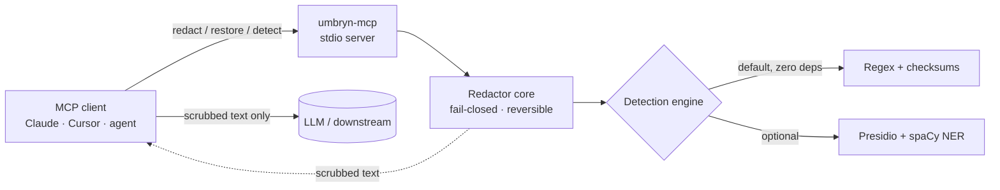

<!-- mcp-name: io.github.Rinava/umbryn-mcp -->

# umbryn-mcp

**An MCP server that redacts PII/PHI from text before it ever reaches an LLM — self-hosted, fail-closed, and HIPAA-aware.**

[](https://pypi.org/project/umbryn-mcp/) 
[](https://github.com/Rinava/umbryn-mcp/actions/workflows/ci.yml)
[](https://pypi.org/project/umbryn-mcp/)
[](LICENSE)
[](https://github.com/astral-sh/ruff)
[](CONTRIBUTING.md)

Teams building LLM and agent pipelines in regulated domains have no clean, drop-in way to strip PHI/PII from a payload *before* it crosses into a model provider's infrastructure. `umbryn-mcp` is that boundary: three MCP tools — `redact`, `restore`, `detect` — that scrub sensitive values into reversible placeholders, run entirely inside infrastructure you control, and **block the request if detection is uncertain instead of leaking data**.

```text
redact("Patient MRN: 1234567, provider NPI 1234567893, ssn 078-05-1120, john.doe@example.com")

  redacted_text  (safe to send to the model):
    "Patient MRN: [MEDICAL_RECORD_NUMBER_1], provider NPI [NPI_1], ssn [US_SSN_1], [EMAIL_ADDRESS_1]"

  token_map      (kept local, never sent to the model):
    [MEDICAL_RECORD_NUMBER_1] → 1234567
    [NPI_1]                   → 1234567893
    [US_SSN_1]                → 078-05-1120
    [EMAIL_ADDRESS_1]         → john.doe@example.com
```

Send the redacted text to the model; keep the `token_map` local; call `restore` afterward to rehydrate the result. Round-trips are **byte-exact** and proven with property-based tests.

---

## Why this exists

The PHI/PII-redaction MCP niche is real but underserved — the existing options are thin Presidio wrappers with no HIPAA-specific detection and, critically, **no guarantee that a detection failure blocks the request** instead of silently passing raw data through. So teams either roll their own boundary or ship sensitive data to a provider and lean on a BAA to cover it — the design-time mistake that causes real compliance incidents.

| | Naive Presidio wrapper | Regex-in-your-app | Cloud DLP API | **umbryn-mcp** |
|---|:---:|:---:|:---:|:---:|
| Drop-in MCP tools | sometimes | ❌ | ❌ | ✅ |
| **Fail-closed** on uncertain detection | ❌ | ❌ | ❌ | ✅ |
| HIPAA identifiers (NPI, DEA, MBI, MRN, CLIA) | ❌ | partial | partial | ✅ |
| Reversible (restore original) | rarely | DIY | some | ✅ |
| Runs self-hosted, **zero egress** | ✅ | ✅ | ❌ (sends data out) | ✅ |
| Works with **zero heavy deps** | ❌ (needs spaCy) | ✅ | n/a | ✅ (regex engine) |
| Optional ML NER (names, addresses) | ✅ | ❌ | ✅ | ✅ (`[presidio]` extra) |

**Why it was built:** MCP went mainstream fast — it's now first-class in Claude, Cursor, and ChatGPT, across thousands of servers — but the PHI/PII-redaction corner was left to a few unmaintained wrappers. This fills that gap with a single honest, auditable, fail-closed boundary, kept open source so the redaction logic you depend on is fully inspectable rather than a black box.

## Features

- **Three tools, one boundary** — `redact` (→ scrubbed text + reversible token map), `restore` (→ original), `detect` (→ entities found, no mutation).
- **Fail-closed by construction** — if detection errors *or any detection lands below the confidence threshold*, the call returns a typed error. Uncertainty blocks; it never redacts-what-it-can and passes the rest.
- **HIPAA-aware detection** — checksum-validated NPI and DEA, position-typed Medicare MBI, context-anchored MRN, CLIA lab IDs, plus standard PII (email, phone, SSN, credit card, IBAN, IP, URL).
- **Zero-egress, self-hosted** — the default engine is pure regex + checksums with **no network calls and no heavy dependencies**. It installs anywhere Python does.
- **Optional ML upgrade** — `pip install "umbryn-mcp[presidio]"` adds Microsoft Presidio + spaCy for `PERSON`/`LOCATION` NER, transparently.
- **Reversible & deterministic** — collision-proof typed placeholders make `restore(redact(x)) == x` for *arbitrary* input; same input + config always yields the same output.

## When to use it (and when not to)

**Reach for `umbryn-mcp` when:**

- You send healthcare, clinical, financial, or user-generated text to a **third-party LLM API** and need PHI/PII kept out of that provider's infrastructure and logs.
- You're building an **agent or MCP pipeline** in a regulated domain and want a drop-in scrubbing boundary you wire in with one tool call.
- You need **reversible** redaction so downstream steps still work: `redact` → send to model → `restore`.
- You want a **self-hosted, no-egress** detector you can audit line by line.
- You need **HIPAA-specific identifiers** (NPI, DEA, Medicare MBI, MRN, CLIA), not just names and emails.

**Reach for something else when:**

- You need **irreversible** de-identification / anonymization (tokenization, k-anonymity) — redaction here is reversible by design.
- You need to redact **non-text** data (images, audio, PDFs, database rows) — scope is text.
- You want a **certified compliance** product — this is one technical control, not a compliance program (see [Scope & honest limitations](#scope--honest-limitations)).
- You want a **transparent proxy** that auto-scrubs everything in the request path — v1 is explicit tool calls; proxy mode is on the [roadmap](ROADMAP.md).
- You require **guaranteed 100% recall** — no detector, this one included, can promise that.

## Quickstart (< 60 seconds)

```bash
pip install umbryn-mcp        # zero heavy deps; runs immediately
```

Then register it with your MCP client.

**Claude Desktop / Claude Code** (`claude_desktop_config.json`, or `claude mcp add umbryn-mcp -- umbryn-mcp`):

```json
{
  "mcpServers": {
    "umbryn-mcp": {
      "command": "umbryn-mcp"
    }
  }
}
```

**Cursor** (`.cursor/mcp.json`) and **VS Code** use the same shape — see [`examples/`](examples/) for ready-to-paste configs.

Want name/address detection too?

```bash
pip install "umbryn-mcp[presidio]"
python -m spacy download en_core_web_lg
```

The server auto-detects Presidio and upgrades — no config change needed. (Set `UMBRYN_ENGINE=regex` to force the dependency-free engine, or `=presidio` to require the ML one.)

## How it works

A tool call comes in over stdio; the `Redactor` core runs the configured detection engine, resolves overlaps deterministically, applies the fail-closed threshold check, and swaps detected spans for reversible typed placeholders. Only scrubbed text is meant to leave the boundary you run.



The `Redactor` core depends only on a small `DetectionEngine` interface — never on Presidio or MCP directly. Raw data and the detection engine stay inside the boundary you run; only scrubbed text leaves it. See [docs/ARCHITECTURE.md](docs/ARCHITECTURE.md) and [docs/THREAT_MODEL.md](docs/THREAT_MODEL.md).

## The tools

### `redact(text) → { redacted_text, token_map, entities }`
Replaces detected PHI/PII with typed placeholders like `[NPI_1]`. `token_map` maps each placeholder back to its original value — **keep it local; never send it to the model.** `entities` lists what was redacted (type/span/score) for auditing.

### `restore(redacted_text, token_map) → { text }`
Reverses a redaction, recovering the original text exactly. Safe to call on model output that still contains the placeholders.

### `detect(text) → { entities, count }`
Reports the entities found — type, span, confidence — **without** modifying the text. Unlike `redact`, it surfaces low-confidence hits rather than blocking, so you can inspect coverage before trusting the boundary in a pipeline.

## How to use it (a real pipeline)

The pattern is **redact → model → restore**, with the token map never leaving your side:

1. **Scrub before the model.** Call `redact(user_text)`. Send only `redacted_text` to the LLM. Keep `token_map` in your process — treat it as sensitively as the raw input, and never pass it to the model.
2. **Let the model work on placeholders.** It sees `[NPI_1]`, `[US_SSN_1]`, etc. — semantically neutral tokens it can reason about and echo back.
3. **Rehydrate after.** Call `restore(model_output, token_map)` to swap the real values back into the model's response before it reaches your user or database.
4. **Handle the block.** If `redact` returns a `[LOW_CONFIDENCE]` or `[DETECTION_ERROR]` tool error, the boundary refused to leak — surface it, tighten input, or lower the risk, but don't send the raw text onward.

Before trusting it in a pipeline, call `detect(sample_text)` on representative (synthetic) data to see exactly what is and isn't caught, and tune the thresholds (below) to your risk tolerance.

## Fail-closed, precisely

Two thresholds govern every `redact` call:

- **`detection_floor`** (default `0.35`) — the sensitivity boundary. Signals below it are treated as noise.
- **`min_confidence`** (default `0.5`) — the *trust* threshold.

Any candidate that survives the floor but scores **below `min_confidence`** puts the call into fail-closed mode: it returns a `[LOW_CONFIDENCE]` error rather than redacting the confident spans and passing the uncertain one through. Engine errors return `[DETECTION_ERROR]`. **On any error, no redacted text is returned.** Both thresholds are configurable (see below).

## Configuration

All optional; sane defaults mean it runs with zero config. Set via the client's `env` block.

| Variable | Default | Meaning |
|---|---|---|
| `UMBRYN_ENGINE` | `auto` | `auto` (Presidio if installed, else regex), `regex`, or `presidio` |
| `UMBRYN_MIN_CONFIDENCE` | `0.5` | Trust threshold; detections below it fail closed |
| `UMBRYN_DETECTION_FLOOR` | `0.35` | Below this, a signal is treated as noise |
| `UMBRYN_MAX_INPUT_CHARS` | `100000` | Reject larger input with a typed error |
| `UMBRYN_SPACY_MODEL` | `en_core_web_lg` | spaCy model for the Presidio engine |
| `UMBRYN_AUDIT_LOG` | `false` | Emit a structured audit record per `redact` call (counts and types only) |
| `UMBRYN_CONFIG` | *(unset)* | Path to a JSON config file (below) |

### Config file

For settings that don't fit a flat environment variable, point `UMBRYN_CONFIG` at a JSON file. Environment variables still win over the file for the scalar values above, so you can ship one file and tweak per launch. A malformed file (bad JSON, unknown threshold, un-compilable regex) fails **closed** at startup rather than degrading silently.

```jsonc
{
  // Per-entity trust thresholds override min_confidence for that type.
  "entity_thresholds": { "PHONE_NUMBER": 0.7, "IP_ADDRESS": 0.9 },

  // Entity types to drop entirely — never detected, never redacted.
  // (A privacy trade-off you're opting into: a disabled type can leak.)
  "disabled_entities": ["URL"],

  // Your own recognizers, no fork required. `validator` names a built-in
  // check-digit function (luhn, npi, dea, iban, nhs) — config supplies data,
  // never code.
  "recognizers": [
    {
      "entity_type": "EMPLOYEE_ID",
      "regex": "\\bEMP-\\d{6}\\b",
      "base_score": 0.85,
      "context": ["employee", "badge"],
      "context_required": false
    }
  ],

  "audit_log": true
}
```

A ready-to-copy example lives at [`examples/umbryn_config.json`](examples/umbryn_config.json).

## Entity coverage

| Entity | Regex engine (default) | Presidio engine (`[presidio]`) |
|---|:---:|:---:|
| Email, Phone, SSN, Credit card, IP, URL | ✅ | ✅ |
| **NPI** (Luhn + 80840 check digit) | ✅ | ✅ |
| **DEA** (check digit) | ✅ | ✅ |
| **Medicare MBI** (position-typed) | ✅ | ✅ |
| **MRN** (context-anchored) | ✅ | ✅ |
| **Medicare HICN** (SSN + beneficiary code) | ✅ | ✅ |
| **CLIA** lab number | ✅ | ✅ |
| **US ITIN** (9XX-range structure) | ✅ | ✅ |
| **UK NHS number** (mod-11 check) | ✅ | ✅ |
| **Canadian SIN** (Luhn check) | ✅ | ✅ |
| **US driver's license** (context-anchored) | ✅ | ✅ |
| **IBAN** (mod-97 / ISO 7064 check) | ✅ | ✅ |
| **Person names** | ❌ | ✅ (spaCy NER) |
| **Addresses / locations** | ❌ | ✅ (spaCy NER) |
| **Custom recognizers** (your regex + check digit, via config) | ✅ | ✅ |

## Benchmark

Detection quality is **measured, not asserted**. The numbers below are the default (zero-dependency) engine scored against the [synthetic eval corpus](eval/) — 200 generated documents, ~1,800 labeled spans, with checksum-failing look-alikes woven in as distractors to keep precision honest. Reproduce them with `python eval/run_eval.py --markdown`.

| Entity | Precision | Recall | F1 | TP | FP | FN |
|---|--:|--:|--:|--:|--:|--:|
| `CANADA_SIN` | 1.00 | 1.00 | 1.00 | 87 | 0 | 0 |
| `CLIA_NUMBER` \* | 1.00 | 1.00 | 1.00 | 105 | 0 | 0 |
| `CREDIT_CARD` | 1.00 | 1.00 | 1.00 | 72 | 0 | 0 |
| `DEA_NUMBER` \* | 1.00 | 1.00 | 1.00 | 119 | 0 | 0 |
| `EMAIL_ADDRESS` | 1.00 | 1.00 | 1.00 | 144 | 0 | 0 |
| `IBAN_CODE` | 1.00 | 1.00 | 1.00 | 87 | 0 | 0 |
| `IP_ADDRESS` | 1.00 | 1.00 | 1.00 | 62 | 0 | 0 |
| `MEDICAL_RECORD_NUMBER` \* | 1.00 | 1.00 | 1.00 | 200 | 0 | 0 |
| `MEDICARE_BENEFICIARY_ID` \* | 1.00 | 1.00 | 1.00 | 126 | 0 | 0 |
| `MEDICARE_HICN` \* | 1.00 | 1.00 | 1.00 | 78 | 0 | 0 |
| `NPI` \* | 0.94 | 1.00 | 0.97 | 200 | 12 | 0 |
| `PHONE_NUMBER` | 1.00 | 1.00 | 1.00 | 144 | 0 | 0 |
| `UK_NHS_NUMBER` | 1.00 | 1.00 | 1.00 | 95 | 0 | 0 |
| `US_DRIVERS_LICENSE` \* | 1.00 | 1.00 | 1.00 | 81 | 0 | 0 |
| `US_ITIN` | 1.00 | 1.00 | 1.00 | 97 | 0 | 0 |
| `US_SSN` \* | 1.00 | 1.00 | 1.00 | 136 | 0 | 0 |

`\*` = HIPAA-relevant identifier, subject to the CI quality gate. **Aggregate over the gated set: precision 0.99, recall 1.00.** The gate fails the build if recall drops below 0.90 or precision below 0.80. (`NPI`'s 12 false positives are look-alike 10-digit numbers that happen to pass the Luhn/80840 check digit — a deliberate, fail-safe bias toward over-redaction.)

These are synthetic, best-case conditions with clean formatting and nearby context words; **real-world text is messier**. Treat this as a regression guardrail and a sanity check, not a guarantee — always evaluate on your own representative data.

## Scope & honest limitations

**This tool reduces PHI/PII exposure at one boundary. It does not make a system "HIPAA compliant."** Compliance is a property of an entire system and organization — its policies, contracts, access controls, audit posture, and people — not of any single library. Running `umbryn-mcp` can be *part* of a compliant design, but it is not a certification, a guarantee, or a substitute for a Business Associate Agreement, a risk assessment, or legal counsel.

Concretely, this project **does not**: guarantee 100% detection (no detector does), de-identify beyond reversible redaction, cover non-text data, or act as a transparent proxy in v1 (redaction is via explicit tool calls you wire in). No detector is perfect — evaluate on your own representative data before relying on it. See [docs/THREAT_MODEL.md](docs/THREAT_MODEL.md) for the full boundary, assumptions, and residual risks, and [SECURITY.md](SECURITY.md) to report issues.

## How to contribute

Contributions are very welcome — this is a deliberately friendly place to make your first open-source PR, and the maintainer tries to respond quickly.

**The easiest high-value contribution:** add a detection recognizer for a new identifier (a regex + an optional check-digit validator + a test). The [add-a-recognizer issue form](https://github.com/Rinava/umbryn-mcp/issues/new?template=add_recognizer.yml) doubles as the spec, and [CONTRIBUTING.md](CONTRIBUTING.md#how-to-add-a-recognizer-the-classic-good-first-issue) walks through the six steps.

Other good ways to help: improve docs, add test cases or example client configs, or pick up something from the [roadmap](ROADMAP.md). Browse [good first issues](https://github.com/Rinava/umbryn-mcp/contribute) or open an issue to propose something.

```bash
git clone https://github.com/Rinava/umbryn-mcp && cd umbryn-mcp
pip install -e ".[dev]"
pytest                 # fast invariant suite (Presidio faked, sub-second)
ruff check . && mypy src/umbryn_mcp
python eval/run_eval.py
```

The full guide — dev setup, conventions, and the **no-real-PHI rule for fixtures** — is in [CONTRIBUTING.md](CONTRIBUTING.md). By contributing you agree your work is MIT-licensed.

## License

[MIT](LICENSE) — matches Presidio and maximizes reuse. Built with [Microsoft Presidio](https://github.com/microsoft/presidio) (optional) and the [MCP Python SDK](https://github.com/modelcontextprotocol/python-sdk).
